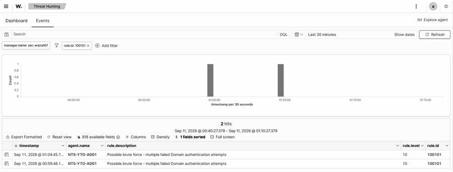
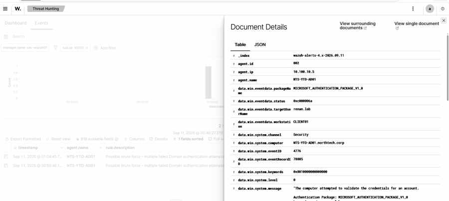
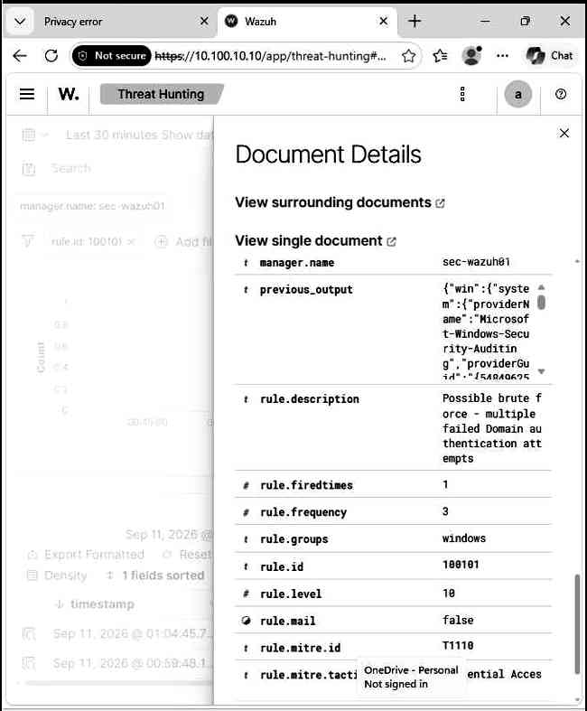

# Domain Credential Brute Force Correlation — Event ID 4776 / Rule 100101

## Overview

This investigation documents a custom Wazuh correlation rule built on Windows Security Event ID `4776` to identify repeated domain credential validation failures.

The activity was generated in a controlled Active Directory lab from `CLIENT01` against the domain account `renan.lab`.

The detection chain was:

```text
CLIENT01
   ↓
Repeated incorrect passwords
   ↓
NTS-YTO-AD01
   ↓
Windows Security Event ID 4776
   ↓
Wazuh Rule 100100 — individual credential failure
   ↓
Wazuh Rule 100101 — correlated possible brute force
   ↓
Level 10 alert
   ↓
MITRE ATT&CK T1110 — Brute Force
```

## Lab Environment

| System | Role | IP |
|---|---|---|
| CLIENT01 | Windows 11 domain workstation | 10.100.10.20 |
| NTS-YTO-AD01 | Active Directory Domain Controller / DNS | 10.100.10.5 |
| sec-wazuh01 | Wazuh Manager / SIEM | 10.100.10.10 |
| FW01-pfSense | Firewall / Gateway | 10.100.10.1 |

Domain: `northtech.corp`

## Source Event

The Domain Controller recorded:

```text
Event ID: 4776
TargetUserName: renan.lab
Workstation: CLIENT01
Status: 0xC000006A
Severity: AUDIT_FAILURE
```

Status `0xC000006A` indicates a valid username with an incorrect password.

## Base Detection — Rule 100100

The previously created custom rule detects each individual failed credential validation:

```xml
<rule id="100100" level="7">
  <if_sid>60104</if_sid>
  <field name="win.system.eventID">4776</field>
  <field name="win.eventdata.status">0xc000006a</field>
  <description>Domain credential validation failed</description>
  <mitre>
    <id>T1110</id>
  </mitre>
</rule>
```

## Correlated Detection — Rule 100101

After validating the event flow, a correlation rule was created to elevate repeated failures:

```xml
<rule id="100101" level="10" frequency="3" timeframe="300">
  <if_matched_sid>100100</if_matched_sid>
  <description>Possible brute force - multiple failed Domain authentication attempts</description>
  <mitre>
    <id>T1110</id>
  </mitre>
</rule>
```

### Detection Logic

- `if_matched_sid=100100`: counts events already classified as domain credential failures.
- `frequency=3`: requires three matching failures.
- `timeframe=300`: evaluates the sequence within five minutes.
- `level=10`: raises the activity above an isolated authentication failure.
- `T1110`: maps the repeated credential attempts to MITRE ATT&CK Brute Force context.

> This is a lab validation threshold, not a universal production recommendation. A production rule should be tuned to the environment and should add identity/source scoping to reduce false positives.

## Troubleshooting and Tuning

Several iterations were tested while validating the correlation logic.

Initial testing used a stricter threshold and shorter time window. The generated SMB/NTLM validation events were more widely spaced than expected, so the test did not always satisfy the correlation window.

The detection was then simplified to validate the correlation pipeline with:

```text
3 failures
within 300 seconds
```

This successfully produced Rule `100101`.

An earlier `same_field` condition was also removed during troubleshooting. The current lab rule therefore demonstrates time/frequency correlation but is broader than a production-ready same-user detector.

## Detection Result

Wazuh Threat Hunting confirmed:

```text
Rule ID: 100101
Rule Level: 10
Description: Possible brute force - multiple failed Domain authentication attempts
Agent: NTS-YTO-AD01
Event ID: 4776
Target User: renan.lab
Workstation: CLIENT01
Status: 0xc000006a
Frequency: 3
MITRE: T1110 — Brute Force
Tactic: Credential Access
```

Two correlated Level 10 alerts were visible during the validation window.

## SOC Interpretation

Repeated credential validation failures can indicate:

- user password mistakes;
- stale cached credentials;
- a misconfigured service or scheduled task;
- password guessing;
- brute-force activity;
- credential misuse.

The correlation alert does **not** prove malicious activity. A SOC analyst should validate:

- the user being targeted;
- source workstation and source IP;
- attempt frequency;
- whether multiple accounts are affected;
- whether a successful authentication follows;
- account lockouts;
- endpoint/process context;
- user confirmation.

## MITRE ATT&CK

```text
Tactic: Credential Access
Technique: T1110 — Brute Force
```

The mapping is contextual: repeated failed credential attempts are behavior consistent with brute-force/password-guessing activity, but the final disposition depends on surrounding evidence.

## Evidence

### Threat Hunting — Rule 100101 / Level 10



### Document Details — Event ID 4776



### MITRE and Correlation Fields



## Key Lessons

- A single failed authentication event is not the same as a behavioral detection.
- Frequency and timeframe materially change the meaning of authentication telemetry.
- Correlation rules must be validated against the actual timing of generated events.
- `alerts.json` confirms alert generation; `archives.json` confirms raw event ingestion.
- MITRE ATT&CK mapping adds behavioral context, not proof of compromise.
- Production tuning should include user/source correlation and environment-specific thresholds.

## Defensive Use Only

This exercise was performed in an isolated cybersecurity lab for defensive training and detection-engineering practice.
