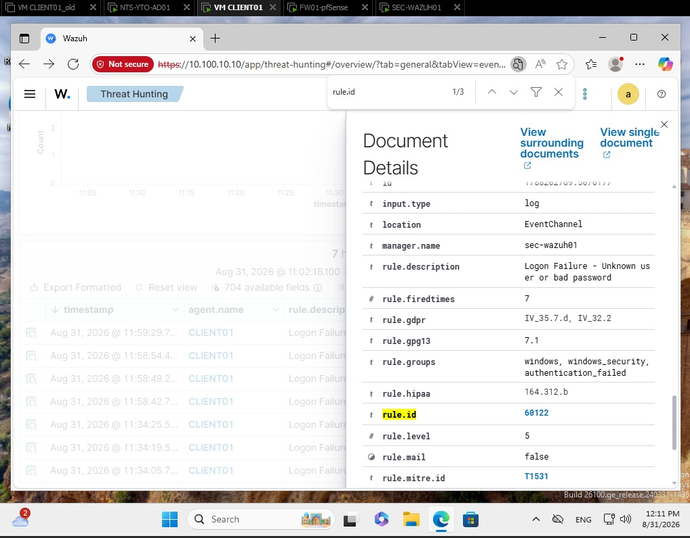
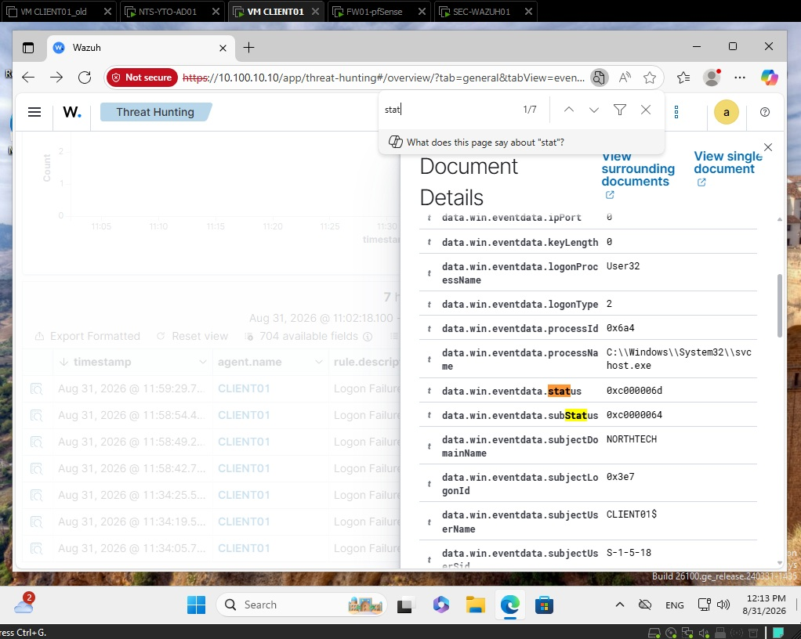

# Windows Failed Logon Investigation — Event ID 4625

## Overview

This investigation documents the detection and analysis of a failed Windows authentication attempt in my SOC lab using Wazuh.

The objective was to generate an authentication failure on a Windows 11 endpoint, detect the event using Wazuh, and analyze the relevant Windows Security Event fields.

## Lab Environment

| Component | Role | IP Address |
|---|---|---|
| pfSense | Firewall / Gateway | 10.100.10.1 |
| SEC-WAZUH01 | Wazuh SIEM Server | 10.100.10.10 |
| NTS-YTO-AD01 | Active Directory / DNS | 10.100.10.5 |
| CLIENT01 | Windows 11 Endpoint | 10.100.10.20 |

Domain:

`northtech.corp`

## Detection

Several invalid authentication attempts were generated on CLIENT01.

The Wazuh agent collected the Windows security event and forwarded it to the Wazuh Manager.

Wazuh generated the following alert:

- Wazuh Rule ID: `60122`
- Rule Description: `Logon Failure - Unknown user or bad password`
- Rule Level: `5`
- Windows Event ID: `4625`

## Event Analysis

The following fields were identified during the investigation:

| Field | Value | Interpretation |
|---|---|---|
| Agent | CLIENT01 | Endpoint where the event occurred |
| Agent IP | 10.100.10.20 | CLIENT01 address |
| Event ID | 4625 | Failed Windows logon |
| Logon Type | 2 | Interactive logon |
| Authentication Package | Negotiate | Windows authentication negotiation |
| Source IP | 127.0.0.1 | Authentication attempt originated locally |
| Status | 0xC000006D | Logon failure |
| SubStatus | 0xC0000064 | User account does not exist |
| Failure Reason | %%2313 | Unknown user name or bad password |

## Technical Interpretation

The Windows event indicated an interactive authentication attempt on CLIENT01.

The `Logon Type 2` value indicates that the attempt occurred directly through the Windows interactive logon interface.

The source address `127.0.0.1` confirms that the authentication attempt originated locally rather than from another host on the network.

The most important values were:

`Status: 0xC000006D`

This represents a generic authentication failure.

`SubStatus: 0xC0000064`

This specifically indicates that the username used during the authentication attempt did not exist.

Therefore, the event was classified as:

**Local interactive authentication attempt using a non-existent user account.**

## SOC Analysis

A single failed authentication attempt may represent normal user error.

However, multiple authentication failures involving invalid usernames may indicate:

- Account enumeration
- Brute-force attempts
- Password spraying
- Misconfigured applications
- Unauthorized authentication attempts

A SOC analyst should correlate the event with:

- Number of failed attempts
- Source IP addresses
- Target usernames
- Authentication type
- Time interval between attempts
- Successful authentication events occurring afterward

## MITRE ATT&CK Context

Potentially related technique:

**T1110 — Brute Force**

Further correlation would be required before classifying the activity as malicious.

## Conclusion

The investigation successfully demonstrated the complete detection workflow:

Windows authentication attempt  
→ Windows Security Event  
→ Wazuh Agent  
→ Wazuh Manager  
→ Wazuh Rule 60122  
→ SOC investigation

This exercise demonstrated practical experience with:

- Windows Security Events
- Wazuh SIEM
- Authentication monitoring
- Log analysis
- Incident investigation
- Active Directory environment
- SOC workflow

## Next Steps

Future improvements to the lab will include:

- Monitoring repeated authentication failures
- Detecting password spraying
- Detecting account lockouts
- Correlating Event IDs 4625, 4771 and 4776
- Creating custom Wazuh detection rules
- Mapping detections to MITRE ATT&CK

## Evidence

### Wazuh detection rule

Wazuh detected the failed authentication event using rule `60122`, classified as:

`Logon Failure - Unknown user or bad password`

### Windows authentication status

The event returned:

- Status: `0xC000006D` — Logon failure
- SubStatus: `0xC0000064` — User account does not exist

These fields confirmed that the authentication attempt used a non-existent username.
