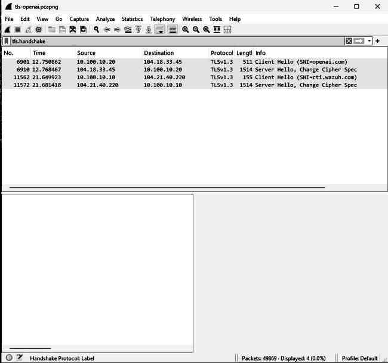
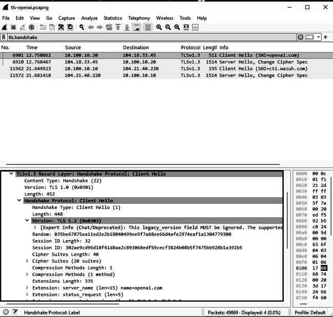
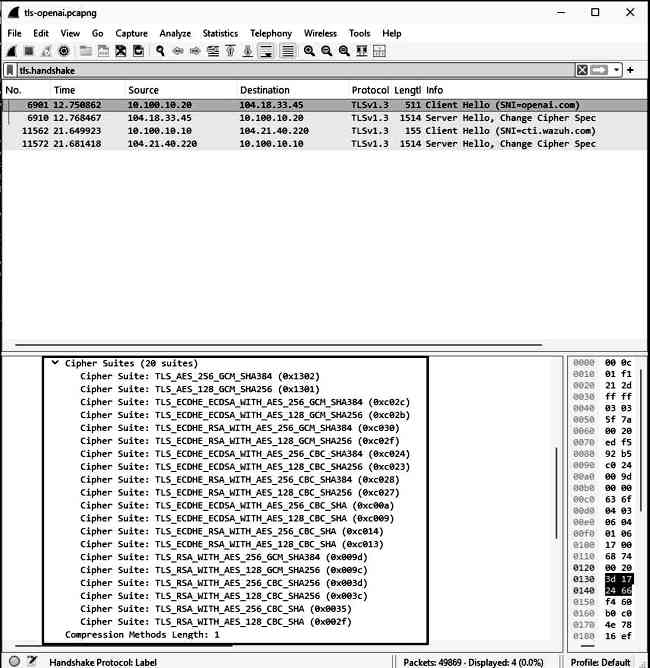

# Sysmon Event ID 3 — PowerShell Network Connection Investigation

## Overview

This investigation documents a controlled SOC lab exercise focused on detecting and analyzing outbound network connections initiated by PowerShell using Sysmon Event ID 3, pfSense, Wireshark and Wazuh.

The objective was to validate the complete path from endpoint activity to network evidence and SIEM ingestion, then test a custom alert rule for PowerShell network activity.

## Lab Environment

- Endpoint: `CLIENT01`
- Endpoint IP: `10.100.10.20`
- Domain: `northtech.corp`
- Default gateway / pfSense LAN: `10.100.10.1`
- DNS / Domain Controller: `10.100.10.5`
- SIEM Manager: `sec-wazuh01`
- Data source: `Microsoft-Windows-Sysmon/Operational`
- Sysmon Event ID: `3 — Network connection`
- Wazuh Agent ID: `001`
- Packet analysis: Wireshark
- Firewall / packet capture: pfSense

## Objective

Validate the following investigation pipeline:

```text
PowerShell
   ↓
Outbound HTTPS connection
   ↓
Sysmon Event ID 3
   ↓
pfSense packet capture
   ↓
Wireshark analysis
   ↓
Wazuh archives.json
   ↓
Custom detection troubleshooting
```

## Sysmon Configuration

Sysmon Event ID 3 telemetry was enabled specifically for PowerShell network connections:

```xml
<NetworkConnect onmatch="include">
  <Image condition="end with">powershell.exe</Image>
</NetworkConnect>
```

## Test Activity

A benign HTTPS request was generated from PowerShell:

```powershell
Invoke-WebRequest https://example.com -UseBasicParsing
```

The request returned:

```text
StatusCode: 200
StatusDescription: OK
```

## Network Troubleshooting Before Capture

Before packet analysis, `CLIENT01` temporarily lost connectivity because the pfSense VM was powered off.

Diagnostics showed:

```text
CLIENT01 IP: 10.100.10.20
Gateway: 10.100.10.1
DNS: 10.100.10.5
```

Tests performed:

```powershell
ping 10.100.10.1
ping 8.8.8.8
nslookup example.com
```

After pfSense was started, connectivity returned. DNS resolution through `10.100.10.5` also succeeded.

This reinforced the troubleshooting sequence:

```text
Local interface
→ gateway
→ Internet reachability
→ DNS resolution
```

## pfSense Packet Capture

Traffic was captured on the pfSense LAN interface with the following filter logic:

```text
Host: 10.100.10.20
Protocol: TCP
Port: 443
```

The capture was exported as a `.pcap` file and opened in Wireshark.

## Wireshark Analysis

A connection associated with the test request was identified as:

```text
10.100.10.20:61437 → 172.66.147.243:443
```

### TCP Three-Way Handshake

Wireshark showed a successful TCP handshake:

```text
10.100.10.20:61437 → 172.66.147.243:443  [SYN]
172.66.147.243:443 → 10.100.10.20:61437  [SYN, ACK]
10.100.10.20:61437 → 172.66.147.243:443  [ACK]
```

Interpretation:

```text
Client: Can I connect?
Server: Yes.
Client: Connection confirmed.
```

### TLS Analysis

The connection then negotiated TLS.

Relevant evidence included:

```text
TLS version: TLS 1.3
SNI: example.com
Selected cipher suite: TLS_AES_256_GCM_SHA384
```

The `Client Hello` exposed the SNI value `example.com`, while the `Server Hello` confirmed the negotiated TLS 1.3 session and selected cipher suite.

The legacy version field displayed `TLS 1.2 (0x0303)`, while the `supported_versions` extension confirmed TLS 1.3. This is expected behavior for TLS 1.3 compatibility.

### Follow TCP Stream

`Follow TCP Stream` confirmed bidirectional data exchange between the endpoint and the external server.

Because the application traffic was protected by TLS, most payload data appeared encrypted and unreadable. However, connection metadata and TLS negotiation details remained useful for investigation.

### Conversation Statistics

Wireshark `Statistics → Conversations` showed approximately:

```text
Endpoints: 10.100.10.20 ↔ 172.66.147.243
Packets: 10
Total data: ~3 KB
CLIENT01 → Server: ~1 KB
Server → CLIENT01: ~2 KB
Duration: ~0.10 seconds
```

The traffic pattern was consistent with a short benign web request.

## Endpoint Correlation with Sysmon Event ID 3

The same session was located in Windows Sysmon Event ID 3.

Relevant fields:

```text
Image: C:\Windows\System32\WindowsPowerShell\v1.0\powershell.exe
User: NORTHTECH\Administrator
Protocol: tcp
Initiated: true
SourceIp: 10.100.10.20
SourcePort: 61437
DestinationIp: 172.66.147.243
DestinationPort: 443
```

The four-tuple matched the Wireshark session:

```text
Source IP
+ Source Port
+ Destination IP
+ Destination Port
```

This allowed the network connection to be attributed directly to `powershell.exe`.

## Wazuh Collection Validation

The same telemetry was successfully received by the Wazuh Manager and stored in:

```text
/var/ossec/logs/archives/archives.json
```

Example evidence:

```text
Image: powershell.exe
SourceIp: 10.100.10.20
SourcePort: 61437
DestinationIp: 172.66.147.243
DestinationPort: 443
Protocol: tcp
Initiated: true
```

This proved the ingestion path was healthy:

```text
CLIENT01
   ↓
Sysmon Event ID 3
   ↓
Wazuh Agent
   ↓
Wazuh Manager
   ↓
archives.json
```

## Native Wazuh Rule Investigation

The native Sysmon rule chain was reviewed.

Base Sysmon channel rule:

```xml
<rule id="60004" level="0">
  <if_sid>60000</if_sid>
  <field name="win.system.channel">^Microsoft-Windows-Sysmon/Operational$</field>
  <description>Group of Windows rules for the sysmon channel.</description>
</rule>
```

Sysmon informational rule:

```xml
<rule id="61600" level="0">
  <if_sid>60004</if_sid>
  <field name="win.system.severityValue">^INFORMATION$</field>
  <description>Windows Sysmon informational event</description>
</rule>
```

Event ID 3 rule:

```xml
<rule id="61605" level="0">
  <if_sid>61600</if_sid>
  <field name="win.system.eventID">^3$</field>
  <description>Sysmon - Event 3: Network connection ...</description>
  <options>no_full_log</options>
  <group>sysmon_event3,</group>
</rule>
```

## Custom Detection Rule 100202

Rule `100202` was repeatedly tested to generate an alert from Sysmon Event ID 3.

Several approaches were validated, including:

- `if_group` with `sysmon_event3`
- `if_sid` with `61605`
- `if_sid` with `61600`
- `if_sid` with `60004`
- direct `win.system.eventID` matching
- direct Sysmon provider matching
- explicit `windows_eventchannel` decoder matching
- temporary removal of PowerShell-specific filters
- syntax validation with `wazuh-analysisd -t`
- manager restart after changes

A minimal form used during troubleshooting was:

```xml
<rule id="100202" level="7">
  <field name="win.system.providerName">Microsoft-Windows-Sysmon</field>
  <field name="win.system.eventID">^3$</field>
  <description>Sysmon Event ID 3 - Network connection detected</description>
</rule>
```

## wazuh-logtest Validation

When the original `full_log` event was passed to `wazuh-logtest`, the event decoded correctly and the rule engine confirmed:

```text
Phase 3: Completed filtering (rules)

id: '100202'
level: '7'
description: 'Sysmon Event ID 3 - Network connection detected'

Alert to be generated
```

This demonstrated that the detection logic itself was valid inside the Wazuh rule engine.

## Live Alerting Limitation

Despite successful rule validation, the same Event ID 3 activity did not generate rule `100202` in the live alert pipeline.

The following were confirmed:

```text
Sysmon Event ID 3 generated             ✅
Endpoint telemetry correct              ✅
Network evidence in Wireshark           ✅
Wazuh Agent forwarding                  ✅
Event present in archives.json          ✅
Structured fields correctly decoded     ✅
Rule syntax valid                       ✅
wazuh-logtest rule match                ✅
wazuh-logtest says alert will generate  ✅
Live alerts.json entry for 100202       ❌
Live alerts.log entry for 100202        ❌
```

The Wazuh Manager and `wazuh-analysisd` were also confirmed active, with the current ruleset loaded successfully.

The system alert threshold was verified as:

```xml
<log_alert_level>3</log_alert_level>
```

Therefore, the Level 7 custom rule was not being suppressed by the configured alert threshold.

## Important Troubleshooting Lesson

This investigation demonstrates the difference between four separate layers:

```text
1. Telemetry generation
2. Event ingestion
3. Rule-engine validation
4. Live alert generation
```

A successful result at one layer does not automatically prove the next layer is functioning.

## SOC Interpretation

The investigated activity was benign and authorized:

```text
powershell.exe
   ↓
10.100.10.20:61437
   ↓
172.66.147.243:443
   ↓
TLS 1.3
   ↓
SNI: example.com
```

In a production environment, the same type of PowerShell network connection would require context before being considered malicious.

Useful investigation questions would include:

- Who executed PowerShell?
- What was the parent process?
- What command line was used?
- Is the destination expected?
- What domain appears in TLS SNI?
- Is the destination associated with threat intelligence?
- Is the connection repeated or periodic?
- How much data was transferred?
- Do other endpoints communicate with the same destination?

## MITRE ATT&CK Context

PowerShell maps to:

```text
T1059.001 — Command and Scripting Interpreter: PowerShell
Tactic: Execution
```

The network telemetry adds context that can support broader investigations involving Command and Control, exfiltration or suspicious external communications, depending on the observed behavior.

## Key Lessons Learned

- Wireshark can confirm TCP handshakes, TLS negotiation, SNI, cipher suites and communication volume without decrypting HTTPS payloads.
- Sysmon Event ID 3 identifies the process responsible for a network connection.
- A network session should be correlated using source IP, source port, destination IP and destination port, not just destination IP.
- `archives.json` proves Wazuh received telemetry; `alerts.json` proves a rule generated an alert.
- `wazuh-logtest` is essential for separating rule-engine problems from live-pipeline problems.
- A Level 0 native rule can classify telemetry without appearing in `alerts.json`.
- Detection engineering includes documenting unsuccessful or partially successful outcomes rather than hiding them.
- Endpoint, network and SIEM evidence together provide much stronger investigative confidence than any single source.

## Final Status

```text
PowerShell HTTPS test: SUCCESS
pfSense packet capture: SUCCESS
Wireshark analysis: SUCCESS
TCP handshake validation: SUCCESS
TLS 1.3 / SNI analysis: SUCCESS
Sysmon Event ID 3 attribution: SUCCESS
Wazuh archives ingestion: SUCCESS
Rule 100202 logtest validation: SUCCESS
Rule 100202 live alert generation: NOT TRIGGERED
Investigation status: COMPLETED WITH DOCUMENTED LIVE-ALERT LIMITATION
```

## Investigation Chain

```text
PowerShell
↓
Sysmon Event ID 3
↓
10.100.10.20:61437
↓
172.66.147.243:443
↓
pfSense PCAP
↓
Wireshark
↓
TCP handshake
↓
TLS 1.3
↓
SNI example.com
↓
Wazuh archives.json
↓
Rule-engine validation with wazuh-logtest
```

## Additional TLS ClientHello Evidence

A separate HTTPS capture was reviewed to reinforce TLS-handshake analysis skills.

The Wireshark evidence showed:

- TLS handshake traffic from `CLIENT01`.
- A TLS `Client Hello`.
- SNI value `openai.com` in the captured ClientHello.
- The offered cipher-suite list.
- TLS 1.3 handshake framing with the compatibility legacy-version field visible in the ClientHello details.

### ClientHello and SNI



### ClientHello Details



### Offered Cipher Suites



This additional exercise reinforces an important SOC/network-analysis concept: even when HTTPS payloads are encrypted, handshake metadata can still provide useful investigative context such as destination domain information and cryptographic negotiation details.

## Disclaimer

This exercise was performed exclusively in a controlled cybersecurity laboratory for educational and defensive security purposes.
